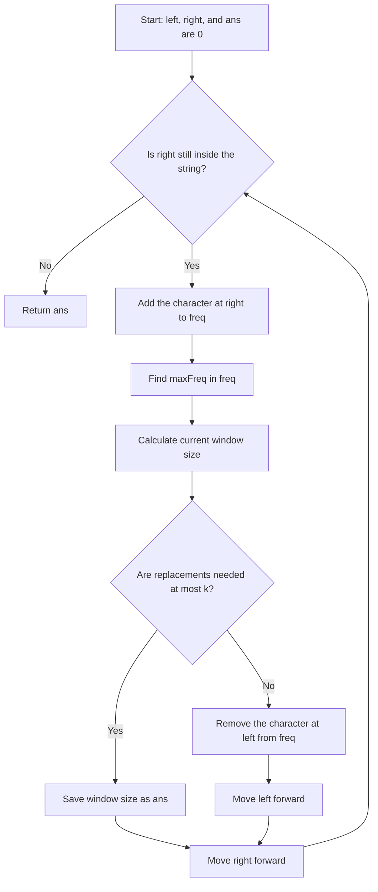

# Longest Repeating Character Replacement

## Problem

Given an uppercase string `s` and an integer `k`, return the maximum length of a substring that can be made of **one repeated character** by replacing at most `k` characters.

Example: `s = "AABABBA"`, `k = 1` → `4`.

`"AABA"` can become `"AAAA"` after replacing one `B`.

## Key observation

For any window:

- Keep the character that occurs most often.
- Replace every other character.

So the replacements required are:

```text
window length - frequency of its most common character
```

The window is valid exactly when:

```text
window length - maxFreq <= k
```

## Sliding-window approach

Use `left` and `right` to represent an inclusive window `s[left:right+1]`.

1. Expand the window by including `s[right]`.
2. Update that character's count in `freq`.
3. Find `maxFreq`, the largest frequency in the window.
4. If the window is valid, it is a candidate answer.
5. If invalid, remove `s[left]` and move `left` right once.
6. Continue until `right` has processed the whole string.



## Why moving `left` once is enough here

Each iteration first extends the window by only one character. If that makes it invalid, the code removes one character from the left and then advances `right`.

It does **not** try to record the invalid size. Therefore `ans` always comes from a valid window. On a later iteration, the same process either expands safely or removes another left-side character. This is an equivalent form of the more common `for invalid { shrink }` implementation.

## Dry run: `s = "AABABBA"`, `k = 1`

| Added character | Window | Most frequent count | Replacements needed | Action | Best |
| --- | --- | ---: | ---: | --- | ---: |
| `A` | `A` | 1 | 0 | valid | 1 |
| `A` | `AA` | 2 | 0 | valid | 2 |
| `B` | `AAB` | 2 | 1 | valid | 3 |
| `A` | `AABA` | 3 | 1 | valid | 4 |
| `B` | `AABAB` | 3 | 2 | invalid; remove first `A` → `ABAB` | 4 |
| `B` | `ABABB` | 3 | 2 | invalid; remove `A` → `BABB` | 4 |
| `A` | `BABBA` | 3 | 2 | invalid; remove `B` → `ABBA` | 4 |

The maximum remains `4`.

## Code map

```go
freq := [26]int{} // count for each uppercase letter A-Z
left := 0         // start of window
right := 0        // end of window being processed
ans := 0          // longest valid length found
```

```go
curr := s[right]
freq[curr-65]++ // ASCII: 'A' is 65, so A→0 ... Z→25
```

Then the loop over `freq` computes `maxFreq`, and:

```go
windowSize := right - left + 1
if windowSize-maxFreq <= k {
    ans = windowSize
    right++
} else {
    freq[s[left]-65]--
    left++
    right++
}
```

## Correctness intuition

At every step, `freq` matches the current window.

- If `windowSize - maxFreq <= k`, changing all non-majority characters makes the window uniform, so its length can be saved in `ans`.
- If the condition fails, no target character can make the full window uniform within `k` replacements, so the window cannot be an answer in its current form. Advancing `left` discards one character and makes progress.
- Both pointers move only forward, so every character enters and leaves the window at most once.

## Complexity

- Time: `O(26 × n)`, which is effectively `O(n)` because there are always 26 uppercase letters.
- Space: `O(26) = O(1)`.

## Common pitfalls

- The answer is the **length**, not the number of replacements.
- Use the count of the **most frequent character in the current window**, not the overall string.
- A window is valid when replacements are **at most** `k` (`<= k`).
- This `[26]int` indexing assumes `s` contains only `A`–`Z`.
- Do not forget to decrement `freq[s[left]-65]` when shrinking.

## Optional standard variant

Many solutions update `right` at the end of every iteration and shrink with a `for` loop. It expresses the same rule more conventionally:

```go
for right := 0; right < len(s); right++ {
    freq[s[right]-'A']++
    maxFreq := 0
    for _, f := range freq {
        if f > maxFreq {
            maxFreq = f
        }
    }
    for right-left+1-maxFreq > k {
        freq[s[left]-'A']--
        left++
    }
    if size := right - left + 1; size > ans {
        ans = size
    }
}
```

Your `solution.go` uses a valid one-shrink-per-iteration formulation; this version is included only as another way to remember the pattern.
