# Note for `main.py`

This file implements `Solution.productExceptSelf(nums)`, which returns a new array where each position contains the product of every number in `nums` except the one at that position.

## What the code does

The current approach builds:

- `prefix[i]`: product of values from `nums[0]` through `nums[i]`
- `suffix[i]`: product of values from `nums[i]` through `nums[-1]`

Then it combines them:

- first element: `suffix[1]`
- last element: `prefix[n - 2]`
- middle elements: `prefix[i - 1] * suffix[i + 1]`

## Example

For `nums = [-1, 1, 0, -3, 3]`, the output is:

`[0, 0, 9, 0, 0]`

## Step-by-step execution

```mermaid
flowchart TD
    A["Start: nums = [-1, 1, 0, -3, 3]"] --> B["Initialize prefix, suffix, result"]

    B --> C1["i = 0"]
    C1 --> C2["prefix[0] = -1"]
    C2 --> C3["i = 1"]
    C3 --> C4["prefix[1] = -1 * 1 = -1"]
    C4 --> C5["i = 2"]
    C5 --> C6["prefix[2] = -1 * 0 = 0"]
    C6 --> C7["i = 3"]
    C7 --> C8["prefix[3] = 0 * -3 = 0"]
    C8 --> C9["i = 4"]
    C9 --> C10["prefix[4] = 0 * 3 = 0"]

    C10 --> D1["i = 4"]
    D1 --> D2["suffix[4] = 3"]
    D2 --> D3["i = 3"]
    D3 --> D4["suffix[3] = 3 * -3 = -9"]
    D4 --> D5["i = 2"]
    D5 --> D6["suffix[2] = -9 * 0 = 0"]
    D6 --> D7["i = 1"]
    D7 --> D8["suffix[1] = 0 * 1 = 0"]
    D8 --> D9["i = 0"]
    D9 --> D10["suffix[0] = 0 * -1 = 0"]

    D10 --> E1["result[0] = suffix[1] = 0"]
    E1 --> E2["result[1] = prefix[0] * suffix[2] = -1 * 0 = 0"]
    E2 --> E3["result[2] = prefix[1] * suffix[3] = -1 * -9 = 9"]
    E3 --> E4["result[3] = prefix[2] * suffix[4] = 0 * 3 = 0"]
    E4 --> E5["result[4] = prefix[3] = 0"]

    E5 --> F["Return result = [0, 0, 9, 0, 0]"]
```

## Complexity

- Time: `O(n)`
- Space: `O(n)` because of the `prefix` and `suffix` arrays

## Important note

This implementation assumes `nums` has at least 2 elements. If `nums` can have length 0 or 1, the code will index out of range when it reads `suffix[i + 1]` or `prefix[i - 1]`.

## Main idea

The solution avoids division and handles zeros naturally because each position is computed from products outside that index.
